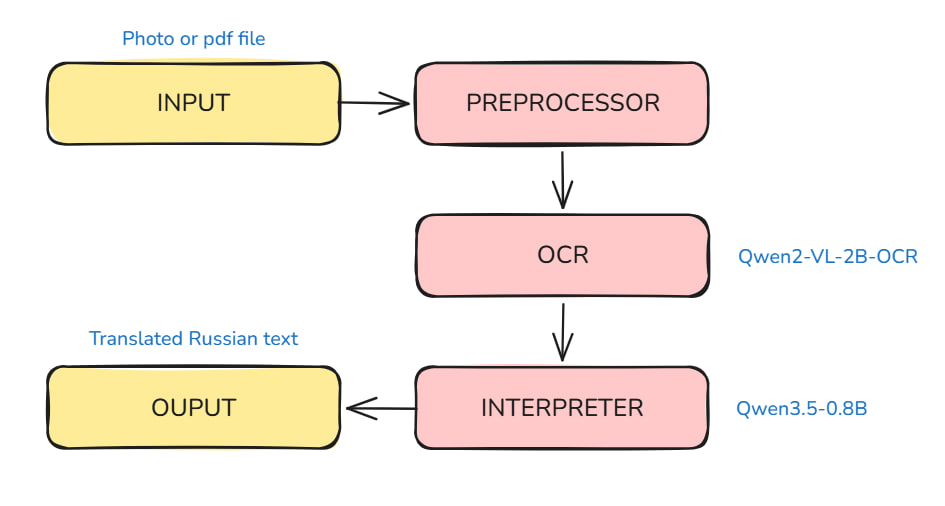
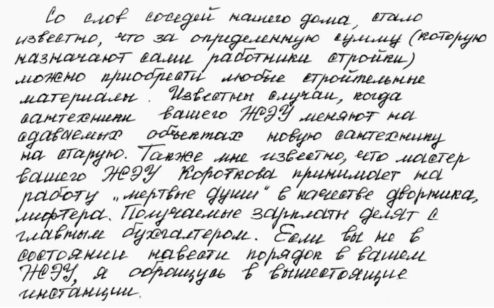
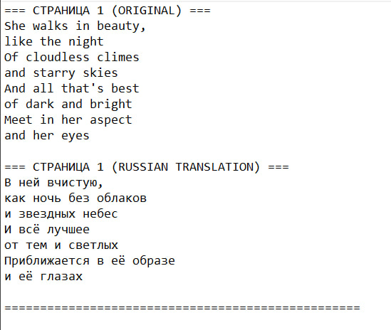
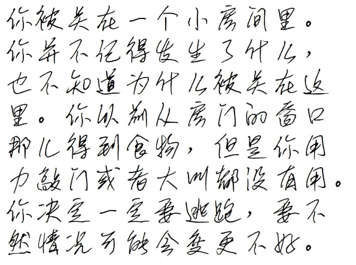
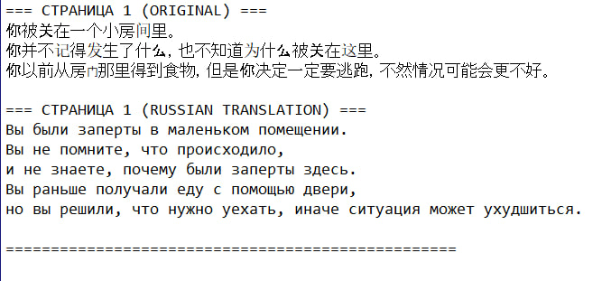

# HistoScan

HistoScan is a Telegram bot for OCR (optical character recognition) and automatic translation of text from photos and handwritten documents into Russian.

Designed for digitizing historical documents, handwritten notes, and printed materials in any language.

## Architecture

The pipeline uses two pretrained models from the Qwen series:
- **[JackChew/Qwen2-VL-2B-OCR](https://huggingface.co/JackChew/Qwen2-VL-2B-OCR)** — recognizes both printed and handwritten text from images in any language
- **[Qwen/Qwen3.5-0.8B](https://huggingface.co/Qwen/Qwen3.5-0.8B)** — translates the recognized text into Russian
- Output is a `.txt` file containing the original extracted text and its Russian translation



## Examples

**Example 1 — Handwritten Russian text:**

| Input image | Output |
|---|---|
|  |  |

**Example 2 — Handwritten English text:**

| Input image | Output |
|---|---|
|  |  |

## Project Structure

```
HistoScan/
├── main.py           # Telegram bot (aiogram)
├── qwenocr.py        # OCR and translation logic (Qwen models)
├── requirements.txt  # Python dependencies
├── .env.example      # Environment variables template
├── .gitignore
└── images/           # Sample inputs and outputs
```

## Requirements

- Python 3.10+
- RAM: at least 4 GB (models run on CPU)
- Disk space: ~5 GB for model weights
- Telegram bot token — get one from [@BotFather](https://t.me/BotFather)
- Hugging Face token — get one at [huggingface.co/settings/tokens](https://huggingface.co/settings/tokens)

## Installation

**1. Clone the repository**
```bash
git clone https://github.com/Bokceris1/HistoScan.git
cd HistoScan
```

[//]: # (**2. Create a virtual environment**)

[//]: # (```bash)

[//]: # (python -m venv venv)

[//]: # ()
[//]: # (# Linux / macOS)

[//]: # (source venv/bin/activate)

[//]: # ()
[//]: # (# Windows)

[//]: # (venv\Scripts\activate)

[//]: # (```)

**2. Install dependencies**
```bash
pip install -r requirements.txt
```

[//]: # (**3. Set up environment variables**)

[//]: # (```bash)

[//]: # (cp .env.example .env)

[//]: # (```)

Create `.env` and fill in your tokens:
```
BOT_TOKEN=your_telegram_bot_token
HF_TOKEN=your_huggingface_token
```

**3. Run the bot**
```bash
python main.py
```

On the first run, the models (~7 GB) will be downloaded automatically from Hugging Face. This may take 5–15 minutes depending on your internet speed.

## Usage

1. Find your bot in Telegram and send `/start`
2. Send an image (JPG, PNG) or a PDF file
3. The bot will return a `result.txt` file with the following structure:

```
=== PAGE 1 (ORIGINAL) ===
<recognized text>

=== PAGE 1 (RUSSIAN TRANSLATION) ===
<translated text>

==================================================
```

If the input text is already in Russian, no translation is applied — the RUSSIAN TRANSLATION block will contain the original text unchanged.
