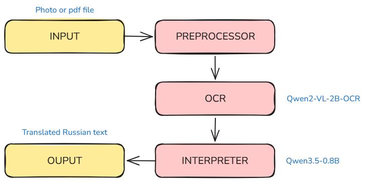

# HistoScan

We present HistoScan, a model for interpreting text from photographs and automatically translating it into Russian.

HistoScan simplifies the digitization of historical documents and handwritten notes, providing a seamless pipeline from raw image to localized text.

# Architecture

We used two pre-trained models from the Qwen series:
- The first is a model for recognizing handwritten and printed text from photographs (Qwen2-VL-2B-OCR)
- The second is a model for text translation (Qwen/Qwen3.5-0.8B)

